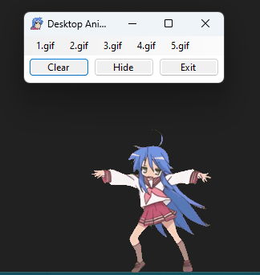

# Desktop-Anime-GIF

[Русский](#-русская-версия)/[English](#-english-version)

## 🇬🇧 English Version

### Description

The application creates an unlimited number of animated GIFs on your desktop that you can move. Simply install the [latest version](https://github.com/alXiMiK21/Desktop-Anime-GIF/releases/latest) and run **DesktopAnimeGIF.exe**

Screenshot:  

### Application capabilities

- Creating an unlimited number of animated GIFs on a desktop that appear over all windows
- Using any 5 .gif files
- User-friendly minimizing to tray (an icon in the taskbar)

### Interface guide

The first 5 buttons create a corresponding GIF  
`Clear` - removes all the GIFs from the screen  
`Hide` - minimizes the application to tray (can be brought back by clicking on the icon)  
`Exit` - closes the application

### Changing GIFs

Open the "GIF" folder and replace the files with new ones, keeping the same filenames. The `1.gif` button corresponds with the "1.gif" file etc.

### Other information

I took most of the code from another [repository](https://github.com/SrMecha/Desktop-Konata), simply modifying it a little.  
MIT license

  

## 🇷🇺 Русская версия
### Описание

Приложение создает неограниченное количество гиф анимации на рабочем столе, которые можно перемещать. Просто скачайте [последнюю версию](https://github.com/alXiMiK21/Desktop-Anime-GIF/releases/latest) и запустите **DesktopAnimeGIF.exe**

Скриншот:  

### Что умеет

- Создавать неограниченное количество гиф анимации на рабочем столе поверх всех окон
- Использование 5 любых .gif файлов
- Удобное сворачивание в трей (значок в панели задач)

### Гайд по интерфейсу

Первые 5 кнопок создают определенную гифку  
`Clear` - удаляет все гифки с экрана  
`Hide` - сворачивает приложение в трей (вернуть можно нажав на значок)  
`Exit` - закрывает приложение

### Замена гиф

Откройте папку "GIF" и замените файлы на другие, при этом название должно остаться такое же. Кнопка `1.gif` берет анимацию из файла "1.gif" и т п

### Прочая информация

Основной код взял из другого [репозитория](https://github.com/SrMecha/Desktop-Konata), я лишь немного модифицировал.  
Лицензия MIT
